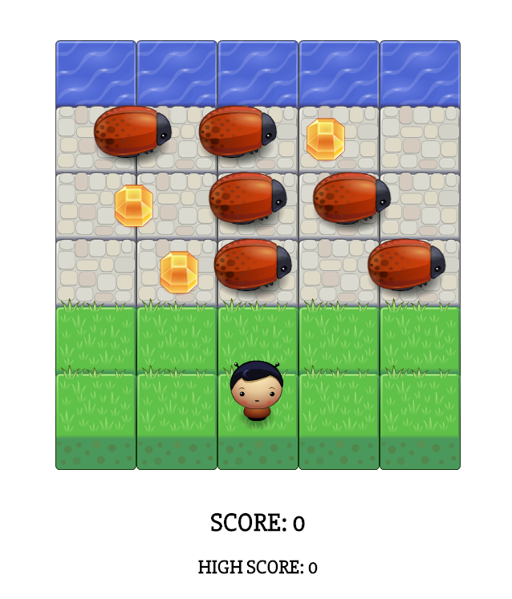

<h1>Bugs and Bugs and Gems and Gems</h1>

<h2>To Run the Game</h2>

After downloading the code and unzipping its contents, you can run the game by navigating to the folder and starting the local server. I use simpleHTTPServer in Python. For more information on this step, go <a href="http://www.pythonforbeginners.com/modules-in-python/how-to-use-simplehttpserver">here</a>. Then I travel to the site on the corresponding port: http://127.0.0.1:8000/ (the default port on most devices is 8000)

You will see this image appear on the screen:

<h2>To Play the Game</h2>

The bugs will be moving endlessly to the right, and the gems will be sliding back and forth. You will play the game using the human-like avatar with antennae. By tapping on the keyboard up, down, left, and right arrow keys, you can manipulate the avatar into crossing the stone roads to the water. If you arrive at the water without bumping into any of the bugs, you score 100 points. At that point, another stone row is added to the game, and you will have to cross four rows before reaching the water. A new row and 100 points is added on every successful crossing.

However, if your avatar bumps into a bug, the game is reset (to just three stone rows) and the score is also reset to zero. But!! If you collect a gem on any row, the bugs on that row disappear for several seconds, aiding you in your epic quest to cross the ever-expanding stone road.

May the force be with you! And may the odds be ever in your favor!

<h2>Notes</h2>

This side project uses object-oriented Javascript and HTML5 Canvas to build a Frogger-like arcade game. The art and foundation of the game engine and rendering was already built by Udacity, and students were asked to complete the code (most of which found in app.js) in order to get the game running. I took the project a big further and added a few surprises in the mix, such as the expanding stone road and the bug-killing gem collection.

